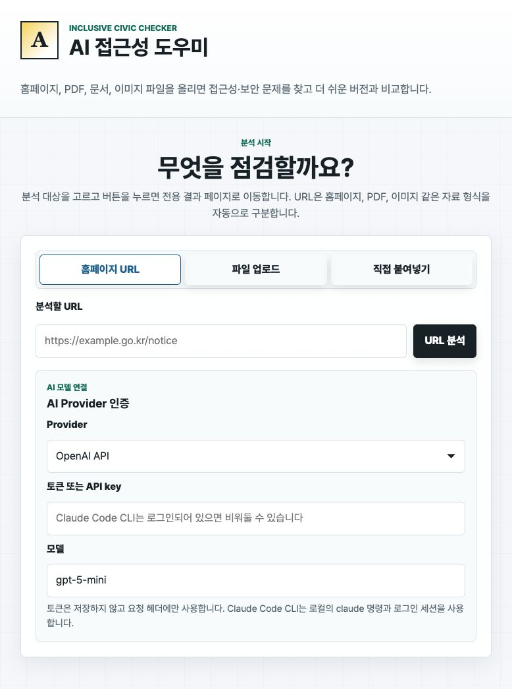
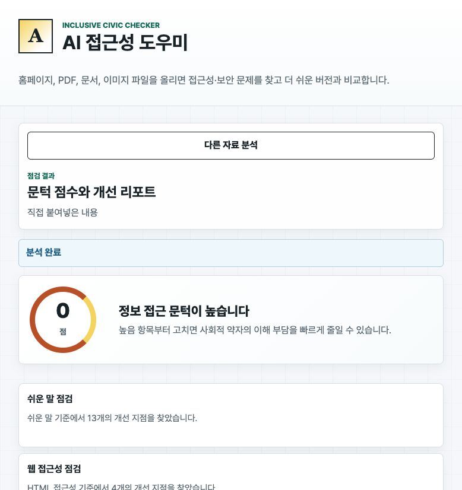
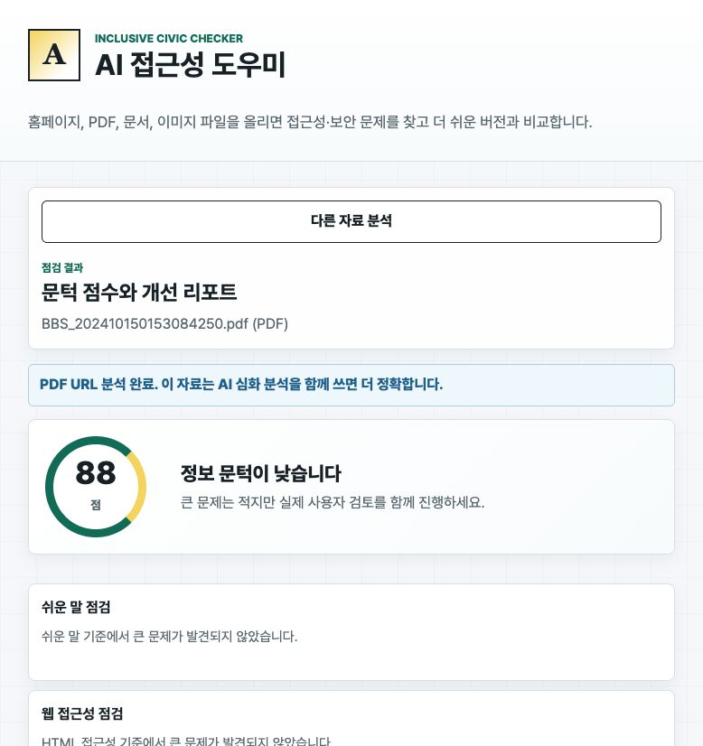

# AI 접근성 도우미 사용가이드

AI 접근성 도우미는 홈페이지 URL, PDF, 문서, 이미지, HTML 안내문을 넣으면 접근성 문제와 개선안을 한 화면에서 비교해 주는 도구입니다. 처음 쓰는 사용자는 샘플 분석으로 1분 안에 흐름을 확인하고, 이후 실제 URL이나 파일을 넣어 분석하면 됩니다.

## 가장 쉬운 사용 흐름

1. 로컬 서버를 실행합니다.

```bash
npm start
```

2. 브라우저에서 `http://127.0.0.1:4173`을 엽니다.
3. 처음에는 `직접 붙여넣기` 탭의 샘플을 그대로 분석합니다.
4. 결과 화면에서 점수, 바운딩 박스, 변경 전/후 비교, 유니버설 디자인 점검을 확인합니다.
5. 익숙해지면 `홈페이지 URL` 또는 `파일 업로드`로 실제 자료를 분석합니다.



## 사용자들이 더 쉽게 써보게 하는 운영 방식

실질적인 확산을 위해서는 기능보다 진입 장벽을 낮추는 것이 먼저입니다.

- 로그인 없이 샘플 분석을 먼저 제공해 결과 화면을 즉시 보여줍니다.
- URL 하나만 넣으면 홈페이지와 PDF를 자동 분기해 사용자가 형식을 고민하지 않게 합니다.
- 결과는 전문가 용어보다 `어디가 문제인지`, `왜 불편한지`, `어떻게 고치면 되는지` 순서로 보여줍니다.
- 개선된 HTML을 렌더링해 원본과 비교하게 하면 비개발자도 변경 효과를 이해하기 쉽습니다.
- 기관 담당자용으로는 공유 가능한 리포트 링크나 PDF 내보내기를 추가하면 도입 설득이 쉬워집니다.
- 개발자용으로는 Codex/Claude Code Skill을 제공해 기존 코드 리뷰 흐름 안에서 재사용하게 합니다.

## 1. 직접 붙여넣기 분석

`직접 붙여넣기` 탭은 가장 빠른 체험용입니다. 안내문 텍스트와 HTML을 붙여넣고 색상 대비 기준까지 함께 입력한 뒤 `붙여넣은 내용 분석`을 누릅니다.

결과 화면에서는 다음 내용을 확인합니다.

- 종합 점수와 주요 개선 요약
- 시각 미리보기 위의 바운딩 박스
- 원본 HTML과 개선 HTML의 변경 표시
- 바뀐 HTML을 실제로 렌더링한 개선 미리보기
- 모두를 위한 설계 점검 패널



## 2. 홈페이지 URL 분석

`홈페이지 URL` 탭에 웹사이트 주소를 입력하면 서버가 HTML을 가져와 제목 구조, 링크명, 이미지 대체 텍스트, 입력 라벨, 보안/개인정보 위험을 점검합니다. 접근 가능한 페이지는 화면 캡처도 함께 생성해 어느 영역을 바꿔야 하는지 바운딩 박스로 보여줍니다.

권장 입력 예시는 다음과 같습니다.

```text
https://example.org
```

분석이 끝나면 결과 페이지로 이동하므로, 입력 화면에서 오래 기다리며 상태를 해석할 필요가 없습니다.

## 3. PDF와 원격 파일 URL 분석

URL이 `.pdf`이거나 응답 형식이 PDF로 감지되면 홈페이지 분석이 아니라 문서 분석 흐름으로 자동 전환됩니다. 텍스트가 추출되는 PDF는 문장 난이도와 안내 구조를 분석하고, 스캔 PDF처럼 텍스트가 추출되지 않는 자료는 AI/OCR 심화 분석이 필요하다고 안내합니다.



## 4. 파일 업로드 분석

`파일 업로드` 탭에서는 PDF, 텍스트, HTML, 이미지, HWP, DOCX 같은 자료를 넣을 수 있습니다.

- 텍스트/HTML/PDF 텍스트: 기본 접근성 분석을 바로 실행합니다.
- 이미지/스캔 PDF/HWP/DOCX: 기본 메타 분석 후 AI 심화 분석을 권장합니다.
- 민감한 개인정보가 포함된 파일은 공개 API로 보내기 전에 비식별 처리하는 것이 좋습니다.

## 5. AI 심화 분석 사용

결과 화면의 `AI로 문서/이미지 심화 분석`을 누르면 선택한 Provider로 더 깊은 분석을 요청합니다.

지원 방식은 다음과 같습니다.

- `OpenAI API`: `OPENAI_API_KEY` 또는 요청별 입력 토큰 사용
- `Anthropic API`: `ANTHROPIC_API_KEY` 또는 요청별 입력 토큰 사용
- `Claude Code CLI`: 로컬에 로그인된 `claude` CLI 세션 사용

Codex 앱에 로그인되어 있어도 로컬 웹앱 서버가 Codex 로그인 권한을 자동으로 상속하지는 않습니다. 일반 로컬 실행에서는 `OPENAI_API_KEY` 사용이 가장 안정적입니다.

## 6. 결과 읽는 법

결과는 의사결정이 쉬운 순서로 배치되어 있습니다.

- `점수`: 현재 자료의 접근성 위험을 빠르게 파악합니다.
- `요약 카드`: 쉬운 말, 웹 접근성, 보안/개인정보 관점의 핵심 위험을 봅니다.
- `시각 검토`: 화면상 어느 영역이 문제인지 바운딩 박스로 확인합니다.
- `변경 전/후`: 어떤 HTML이 어떻게 바뀌는지 비교합니다.
- `개선 렌더링`: 바뀐 HTML이 사용자에게 어떻게 보이는지 확인합니다.
- `모두를 위한 설계 점검`: 유니버설 디자인, WCAG, UDL 기준으로 빠진 관점을 보완합니다.

## 다음에 추가하면 좋은 기능

사용자가 더 쉽고 간편하게 쓰려면 다음 기능이 특히 효과적입니다.

- 분석 결과를 공유 링크나 PDF 리포트로 내보내기
- 기관 로고와 프로젝트명을 넣는 리포트 템플릿
- URL 여러 개를 한 번에 검사하는 배치 분석
- OCR 연결로 이미지 안내문과 스캔 PDF 텍스트 추출
- GitHub Actions 또는 Codex/Claude Code Skill 기반 자동 접근성 리뷰
